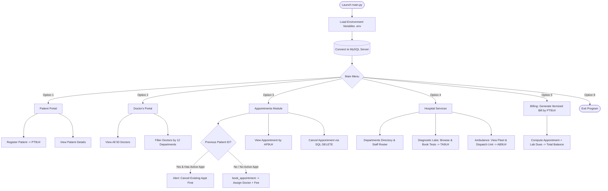

# 🏥 Medicare Hospital Management System

[](https://www.python.org/)
[](https://www.mysql.com/)
[](https://pandas.pydata.org/)
[](https://opensource.org/licenses/MIT)
[](#)

> **A comprehensive Command Line Interface (CLI) Hospital Management System** developed in Python with a robust MySQL relational database backend. Designed to streamline patient registrations, doctor directories, appointment scheduling with double-booking prevention, laboratory diagnostics, ambulance dispatching, and dynamic patient billing.

---

## 👥 Authors & Project Information

* **Python Application Developer:** Mohit Singh
* **Database Architect & Manager:** Dev Chauhan
* **Project Context:** Informatics Practices / Computer Science Project
* **Development Date:** August 2026

---

## 📑 Table of Contents

- [Overview](#-overview)
- [Key Features & Modules](#-key-features--modules)
  - [1. Patient Portal](#1-patient-portal)
  - [2. Doctor's Portal](#2-doctors-portal)
  - [3. Appointments Management](#3-appointments-management)
  - [4. Hospital Services Explorer](#4-hospital-services-explorer)
  - [5. Billing & Invoice Generation](#5-billing--invoice-generation)
  - [6. Robust Error Handling & Security](#6-robust-error-handling--security)
- [System Architecture & Workflow](#-system-architecture--workflow)
- [Database Schema & Architecture](#-database-schema--architecture)
- [Project Directory Structure](#-project-directory-structure)
- [Installation & Setup Guide](#-installation--setup-guide)
  - [Prerequisites](#prerequisites)
  - [Step 1: Clone Repository](#step-1-clone-repository)
  - [Step 2: Set Up Virtual Environment](#step-2-set-up-virtual-environment)
  - [Step 3: Install Dependencies](#step-3-install-dependencies)
  - [Step 4: Configure Environment Variables](#step-4-configure-environment-variables)
  - [Step 5: Initialize MySQL Database](#step-5-initialize-mysql-database)
  - [Step 6: Run the Application](#step-6-run-the-application)
- [CLI Interface & Sample Walkthrough](#-cli-interface--sample-walkthrough)
- [Technology Stack](#-technology-stack)
- [Development Roadmap](#-development-roadmap)
- [Contributing](#-contributing)
- [License](#-license)

---

## 📖 Overview

**Medicare Hospital Management System** is an interactive, menu-driven CLI application designed to automate day-to-day hospital operations. Built on top of Python 3 and MySQL, the application enables staff, patients, and administrators to interact seamlessly with hospital records while ensuring data validation, relational integrity, business logic enforcement, and tabular formatting.

### Primary Objectives:
- Provide an intuitive, crash-resistant terminal user interface.
- Maintain persistent records across 8 relational tables in MySQL.
- Enforce validation rules (e.g., active appointment check before re-booking, alphabetical name checks for ambulance dispatch).
- Automate identifier generation (`PT9U...` for patients, `AP9U...` for appointments, `TA9U...` for lab tests, `AB9U...` for ambulances).
- Output query results using structured Markdown tables rendered through `pandas` and `tabulate`.

---

## ✨ Key Features & Modules

```
===================================================================================
                             Medicare Hospital Welcomes you                          
===================================================================================

1) Patient portal
2) Doctor's portal
3) Appointments
4) More services (Hospital services)
5) Billing
6) Emergency information (Upcoming)
7) About the hospital (Upcoming)
8) Exit
```

### 1. Patient Portal
* **Patient Registration:**
  * Collects comprehensive patient profiles: Full Name, Age, Gender (`M`/`F`), Blood Group (`A+`, `O+`, `B+`, etc.), Residential Address, and Contact Number.
  * Formats phone numbers automatically with country code (`+91 `).
  * Automatically assigns a sequential, unique identifier (e.g., `PT9U1`, `PT9U2`, ...).
  * Inserts records into the `patients_info` MySQL table.
* **View Patient Records:**
  * Validates patient ID prefix format (`PT9U`).
  * Queries database and displays complete profile details in a clean tabular view.
  * Gracefully informs user if the specified ID is not found.

---

### 2. Doctor's Portal
* **View Full Medical Staff:**
  * Retrieves and renders complete directory of 50 in-house specialist doctors.
  * Displays Doctor ID (`DR9P1` – `DR9P50`), Doctor Name, Clinical Department, and Years of Experience.
* **Search Doctors by Medical Division:**
  * Interactive filtering across **12 distinct medical departments**:
    1. *Cardiology* | 2. *Dermatology* | 3. *Endocrinology* | 4. *Gynecology*
    5. *Neurology* | 6. *Oncology* | 7. *Ophthalmology* | 8. *Orthopedics*
    9. *Pediatrics* | 10. *Psychiatry* | 11. *Radiology* | 12. *Urology*
  * Dynamically filters and displays specialists matching the requested department.

---

### 3. Appointments Management
* **Existing Patient Verification & Double-Booking Prevention:**
  * Verifies if a user already holds a Patient ID (`PT9U...`).
  * Queries active appointments in the database to prevent duplicate active bookings, advising the patient to either cancel their pending appointment first or proceed with new credentials.
* **Book an Appointment (`book_appointment`):**
  * Collects patient demographics and clinical division required.
  * Registers or links the patient record in `patients_info`.
  * Dynamically queries doctors in the selected specialty and assigns an available specialist at random (`random.choice`).
  * Fetches the department consultation fee (`departments.consulting_fee`).
  * Schedules the appointment for the next calendar day (`today + 1 day`).
  * Generates unique Appointment ID (e.g., `AP9U1`) and outputs a full confirmation receipt.
* **View Appointment Status:**
  * Queries appointment records by Appointment ID (`AP9U...`).
  * Displays patient name, allocated doctor, department division, appointment date, patient ID, and consulting fee.
* **Cancel Appointment:**
  * Allows cancellation of existing appointments using the Appointment ID.
  * Executes a parameterized SQL `DELETE` query, commits changes, and provides instant confirmation.

---

### 4. Hospital Services Explorer

#### 🏢 Departments Directory
* **View All Departments:** Lists all 12 operational departments in alphabetical order.
* **Department Details & Roster:**
  * Fetches detailed clinical overview, scope of care, and consultation pricing (`DEP01` – `DEP12`).
  * Dynamically calculates and displays the total number of doctors on staff in that department.
  * Renders a live roster of available specialists with their IDs, names, and experience.

#### 🔬 Diagnostics & Laboratory Tests
* **Browse Test Catalog:**
  * Details 10 standard diagnostic tests with descriptions, pricing in INR, and associated departments:
    * `LT001`: **CBC / Complete Blood Count** (₹350)
    * `LT002`: **Blood Sugar** (₹150)
    * `LT003`: **Lipid Profile** (₹600)
    * `LT004`: **Liver Function Test (LFT)** (₹800)
    * `LT005`: **Kidney Function Test (KFT)** (₹700)
    * `LT006`: **Thyroid Profile** (₹650)
    * `LT007`: **Urine Test** (₹250)
    * `LT008`: **X-Ray** (₹500)
    * `LT009`: **CT Scan** (₹3,500)
    * `LT010`: **MRI Scan** (₹6,500)
* **Book Lab Test:**
  * Enrolls patient details, schedules test for the next day, and creates a booking record (`TA9U...`).
  * Informs the patient of the booking reference and clinic cancellation policy.

#### 🚑 Ambulance Fleet & Emergency Dispatch
* **Fleet Availability Viewer:**
  * Displays live operational status for 20 hospital ambulances (`AM9U1` – `AM9U20`) as `Available` or `On Duty`.
* **Instant Ambulance Dispatch:**
  * Validates requester's name against invalid non-alphabetical characters.
  * Finds currently available ambulances and randomly allocates an active unit.
  * Logs the booking under `ambulance_bookings` (`AB9U...`) with a standard fixed dispatch fee (₹250.00).
  * Automatically switches vehicle status in `ambulance_record` to `'On Duty'`.

---

### 5. Billing & Invoice Generation
* Prompts for Patient ID (`PT9U...`).
* Dynamically fetches:
  * **Doctor Consultation Fees** from `appointments`.
  * **Diagnostic Lab Test Charges** from `lab_test_bookings`.
* Automatically evaluates and handles all billing scenarios:
  * *Appointment Only*: Defaults lab test fees to `₹0.00` and calculates total.
  * *Lab Test Only*: Defaults appointment fees to `₹0.00` and calculates total.
  * *Combined Dues*: Sums consultation and diagnostic charges into a final grand total.
  * *Zero Dues*: Outputs a clean `₹0.00` total balance if no active charges exist.
* Renders an itemized, markdown-formatted billing receipt.

---

### 6. Robust Error Handling & Security
* **Environment Protection:** Database credentials are securely loaded from a local `.env` file and excluded from version control via `.gitignore`.
* **SQL Injection Prevention:** Uses parameterized SQL queries (`%s` placeholders with value tuples).
* **Input Validation:** Enforces integer type validation and string constraints to prevent runtime crashes.
* **Resource Cleanup:** All database transactions use `try...except...finally` blocks to guarantee cursor and connection closure.

---

## 🏗️ System Architecture & Workflow



---

## 🗄️ Database Schema & Architecture

The database `new_database` consists of 8 interconnected tables:

| Table Name | Primary Key | Description | Key Fields |
| :--- | :--- | :--- | :--- |
| `patients_info` | `ID` (`VARCHAR(10)`) | Stores registered patient demographic profiles | `ID`, `Name`, `Age`, `Gender`, `B_goup`, `Address`, `Phone` |
| `doctors_info` | `ID` (`VARCHAR(7)`) | Contains list of 50 specialist doctors | `ID`, `Names`, `Department`, `Experience` |
| `departments` | `ID` (`VARCHAR(5)`) | 12 hospital departments with descriptions & fees | `ID`, `Department_Name`, `Description`, `consulting_fee` |
| `appointments` | `ID` (`VARCHAR(7)`) | Patient appointment bookings & assignments | `ID`, `P_Name`, `Doctor`, `Division`, `Date`, `patient_ID`, `Consulting_fee` |
| `laboratory_tests` | `ID` (`VARCHAR(5)`) | Catalog of 10 available diagnostic lab tests | `ID`, `Test`, `Description`, `Charges`, `Department` |
| `lab_test_bookings`| `ID` (`VARCHAR(7)`) | Bookings for laboratory diagnostic tests | `ID`, `Name`, `Age`, `Gender`, `Phone_No`, `Department`, `Date`, `patient_ID`, `Test_charges` |
| `ambulance_record` | `ID` (`VARCHAR(7)`) | Fleet record of 20 ambulance vehicles | `ID`, `Status` (`Available` / `On Duty`) |
| `ambulance_bookings`| `ID` (`VARCHAR(10)`)| Dispatch logs for booked ambulances | `ID`, `Name`, `Ambulance`, `Fee` |

---

## 📁 Project Directory Structure

```plaintext
Schl-project-pr/
├── .env                       # Database credentials (kept locally, ignored by Git)
├── .env.example               # Example environment variable template
├── .gitignore                 # Specifies intentionally untracked files
├── main.py                    # Main executable Python CLI application
├── new.sql                    # MySQL Database schema definition and seed data
├── README.md                  # Project documentation (this file)
├── test.py                    # Internal testing / helper script
├── IP-project_original.docx   # Original project documentation report
└── IP_Project_edited.docx     # Edited project documentation report
```

---

## ⚙️ Installation & Setup Guide

### Prerequisites
- **Python 3.8 or higher** installed on your system. ([Download Python](https://www.python.org/downloads/))
- **MySQL Server 8.0 or higher** installed and running locally or remotely. ([Download MySQL](https://dev.mysql.com/downloads/mysql/))

---

### Step 1: Clone Repository
```bash
git clone https://github.com/Mohit-pr-95/Schl-project-pr.git
cd Schl-project-pr
```

---

### Step 2: Set Up Virtual Environment (Recommended)
```bash
# Windows (PowerShell / Command Prompt)
python -m venv venv
venv\Scripts\activate

# macOS / Linux
python3 -m venv venv
source venv/bin/activate
```

---

### Step 3: Install Dependencies
Install all required libraries via `pip`:
```bash
pip install mysql-connector-python pandas python-dotenv tabulate
```

> **Note:** `tabulate` is required by `pandas.DataFrame.to_markdown()` for terminal table formatting.

---

### Step 4: Configure Environment Variables
Create a `.env` file in the project root directory (use [`.env.example`](file:///c:/Users/Mohit%20Singh/OneDrive/Desktop/my_work/Schl-project-pr/.env.example) as reference):

```env
Database_host = localhost
Database_user = root
Database_pass = your_mysql_password
Database_name = new_database
```

---

### Step 5: Initialize MySQL Database
Open your MySQL client / command line and execute the `new.sql` script to set up the database, create tables, and populate seed data:

```bash
# Using MySQL CLI
mysql -u root -p < new.sql
```

Alternatively, open `new.sql` in **MySQL Workbench**, **DBeaver**, or **VS Code Database Extension** and run the entire script.

---

### Step 6: Run the Application
Run the primary script:
```bash
python main.py
```

---

## 💻 CLI Interface & Sample Walkthrough

### 1. Doctor Directory Preview
```markdown
| ID     | Names           | Specialization   | Experience (Years) |
|:-------|:----------------|:-----------------|:-------------------|
| DR9P1  | Aarav Mehta     | Cardiology       | 12                 |
| DR9P2  | Diya Sharma     | Neurology        | 8                  |
| DR9P3  | Rohan Kapoor    | Orthopedics      | 15                 |
| DR9P4  | Anaya Verma     | Dermatology      | 6                  |
| DR9P5  | Vivaan Malhotra | Pediatrics       | 10                 |
```

### 2. Appointment Booking Confirmation
```markdown
| ID (Remember it) | Patient    | Age | Division   | Doctor appointed | Consulting Fee(INR) | Date of Appointment | Patient ID (Remember it) |
|:-----------------|:-----------|:----|:-----------|:-----------------|:--------------------|:--------------------|:-------------------------|
| AP9U1            | John Doe   | 34  | Cardiology | Aarav Mehta      | 1200.00             | 2026-09-01          | PT9U1                    |
```

### 3. Patient Billing & Invoice Receipt
```markdown
| Patient ID | Appointment charges | Lab test charges | Total      |
|:-----------|:--------------------|:-----------------|:-----------|
| PT9U1      | INR 1200.00         | INR 600.00       | INR 1800.00|
```

### 4. Ambulance Fleet Viewer
```markdown
| ID     | Status    |
|:-------|:----------|
| AM9U1  | Available |
| AM9U2  | Available |
| AM9U3  | On Duty   |
| AM9U4  | Available |
```

---

## 🛠️ Technology Stack

| Component | Technology | Purpose |
| :--- | :--- | :--- |
| **Language** | Python 3.x | Core application logic and CLI interface |
| **Database** | MySQL | Relational database management system |
| **Connector** | `mysql-connector-python` | Python-to-MySQL database driver |
| **Data Formatting** | `pandas` + `tabulate` | Transforming SQL query tuples into Markdown tables |
| **Environment Mgmt** | `python-dotenv` | Secure loading of database credentials |
| **Standard Libraries** | `datetime`, `random`, `os`, `shutil` | Date calculations, random assignment, OS interactions |

---

## 🚀 Development Roadmap

- [x] **Patient Portal:** Registration, patient ID generation (`PT9U...`), and record retrieval.
- [x] **Doctor Portal:** Directory of 50 doctors across 12 clinical specialties with department filter.
- [x] **Appointments Module:** Complete lifecycle (Booking with random specialist allocation, ID tracking, cancellation, and double-booking prevention).
- [x] **Departments Explorer:** Complete medical overview, consulting fee structure, and doctor counts.
- [x] **Laboratory & Diagnostics:** Catalog of 10 tests, pricing, and next-day appointment scheduling.
- [x] **Ambulance Dispatch:** Real-time fleet tracking of 20 vehicles, auto-dispatch, and fee logging.
- [x] **Billing System:** Dynamic consolidated consultation and laboratory expense invoicing with grand total computation.
- [ ] **Pharmacy Portal:** Medicine inventory, stock tracker, and prescription dispensing.
- [ ] **Emergency Contact & Information Module:** Rapid triage contact directory and emergency guidelines.
- [ ] **Data Modification:** Update capabilities for existing patient and doctor records.
- [ ] **Graphical User Interface (GUI):** Desktop GUI with Tkinter / PyQt or Web UI with Flask/FastAPI.

---

## 🤝 Contributing

Contributions, bug reports, and suggestions are welcome!
1. Fork the repository.
2. Create your feature branch (`git checkout -b feature/NewFeature`).
3. Commit your changes (`git commit -m 'Add NewFeature'`).
4. Push to the branch (`git push origin feature/NewFeature`).
5. Open a Pull Request.

---

## 📄 License

This project is created for educational and school project demonstration purposes. Released under the [MIT License](https://opensource.org/licenses/MIT).